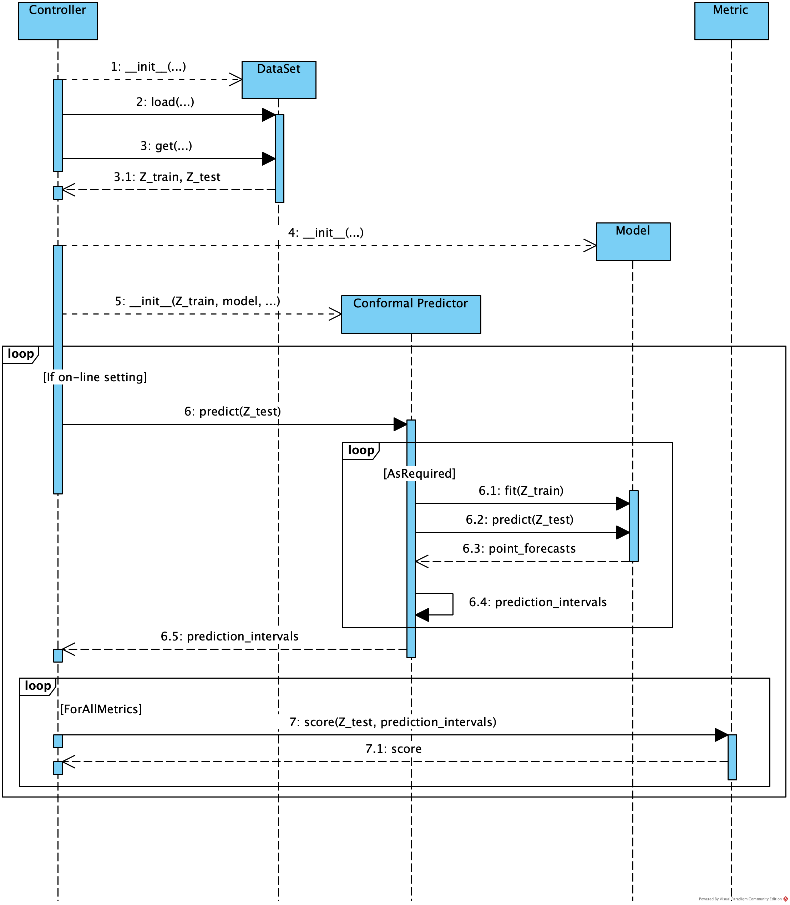

# Conformal Multistep-Ahead Multivariate Time-Series Forecasting

This repository contains the code necessary to reproduce the results of my master's thesis on Conformal Multistep-Ahead
Multivariate Time-Series Forecasting.

## Structure

The repository contains two main directories.
`./assests/` contains everything that is not code such as data sets, the configuration files for the experiments and
their results.
`./src/` contains the code to process the datasets and run the experiments.

`├── assets`  
`│   ├── data_sets.....................` Datasets.    
`│   ├── experimental_configurations...` Configuration files for the experiments.    
`│   └── experimental_results..........` Results of experiments will be saved here.  
`└── src`  
`.   ├── conformal_predictors...........` Package implementing variations of Conformal Predictors.  
`.   ├── data_ingest....................` Package for classes that load and preprocess the different datasets.
They adhere to a common interface.    
`.   ├── experiments....................` Package that facilitates the execution of multiple trials of the same
experiment and the storage of the results.   
`.   ├── metrics........................` Package that implements the metrics used to evaluate the experimental
results.  
`.   ├── models.........................` Package for classes implementing the different underlying models.  
`.   ├── scripts........................` TODO: add description  
`.   └── utils..........................` Package containing utilities for plotting the results and for managing
the experiments' parameters.

## Getting started

## Software Architecture

This software architecture is meant to be modular with little cohesion between the classes that make up the
different steps in the pipeline.
These steps are

1. Loading, and preprocessing the data done by the `DataSet` classes (Steps 1 to 3.1 in the sequence diagram)
2. Generating the prediction interval (Steps 4 to 6.5 in the sequence diagram)
    1. Initializing the underlying model
    2. Training the underlying model, if necessary done by the `ConformalPredictor` classes
    3. Calibrating the prediction intervals done by the `ConformalPredictor` classes
3. Evaluating the resulting prediction intervals done by the Metric classes (Steps 7 and 7.1 in the sequence diagram)

No direct calls are made to a class belonging to a different step.
Only data is exchanged between steps, facilitated by the `Controller`, which can be a script or JupyterNotebook and does
not need to be a dedicated class.

Furthermore, the architecture works in an on-line, off-line and batch setting, as the orchestration of these scenarios
is left to the controller.

### General Sequence

The general sequence of events is already described by the steps in the previous section.
Noteworthy is, that this setup is not only suitable for experiments but can be used in a setting, where samples are
presented sequentially, i.e. it can de deployed in a on-line setting.

